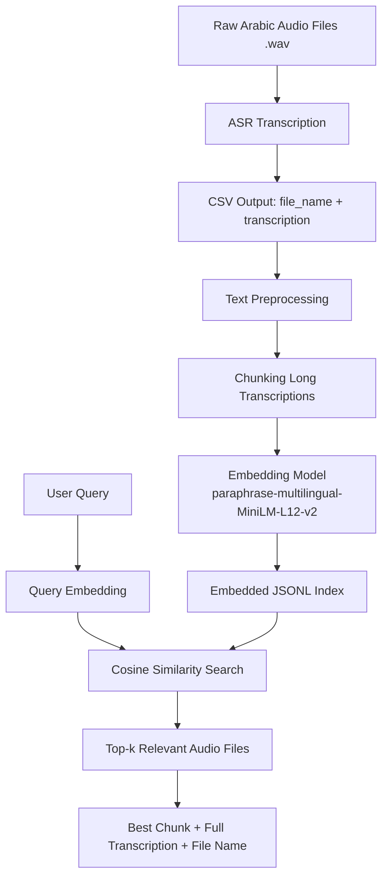

# Egyptian Arabic Audio Semantic Search System

## Overview
This project retrieves relevant arabic audio files based on semantic meaning of their transcriptions.  
The pipeline converts audio files into text, embeds the transcriptions using a multilingual sentence transformer, and performs semantic search to return the most relevant audio files. A 

## Pipeline
1. Transcribe audio files into text
2. Save file names and transcriptions in a CSV file
3. Generate embeddings from the CSV
4. Store embedded chunks in JSONL format
5. Perform semantic search to retrieve the most relevant audio files

## Main Files
- `asr/Project2_Preprocessing+Transcript`: copies and mounts a drive folder of audio files, performs preprocessing, then transcribes the audio files contents and saves them into a CSV (used on Colab)
- `embedding/embedding_from_csv.py`: generates embeddings from CSV transcriptions
- `search/semantic_search_audio.py`: retrieves audio files using semantic similarity
- `settings.cfg`: configuration file for embedding model and search settings

## Run
```bash
python embedding/embedding_from_csv.py
python search/semantic_search_audio.py
```

## Input
CSV file with:
- file_name
- transcription

## Output
JSONL file containing:
- file name
- chunk text
- full transcription
- embedding vector

## Search output:
- ranked relevant audio files
- similarity score
- best matching chunk

## Dataset Description
The dataset is a closed source dataset, consisting of Egyptian dialect Arabic audio recordings stored as `.wav` files, with filenames in the format `ARA NORM XXXXX.wav`.  Each audio file represents one speech sample.
The audio files were transcribed automatically using an Arabic ASR model. The resulting transcriptions were stored in a CSV file with two main columns: `file_name` and `transcription`. To support semantic retrieval, each transcription was converted into vector embeddings using the `sentence-transformers/paraphrase-multilingual-MiniLM-L12-v2` model. Long transcriptions were split into smaller chunks before embedding, based on the configured chunk size and maximum token length.

The final embedded dataset was saved in JSONL format, where each line contains:
- file name
- row index
- chunk index
- chunk text
- full transcription
- embedding vector

| Field | Description |
|---|---|
| `file_name` | Original audio file name |
| `transcription` | ASR output text |
| `text` | Embedded text chunk |
| `full_transcription` | Full transcription for the audio file |
| `chunk_index` | Index of chunk within the same file |
| `embedding` | Dense vector representation of the text |

Preprocessing included:
- reading transcriptions from CSV
- cleaning whitespace
- optional Arabic normalization
- token-based chunking for long texts
- embedding generation with normalized sentence vectors

## System architecture diagram



## Experiments
Several experiments were conducted to analyze the performance of the proposed system. First, multiple ASR models were tested to determine which model produced the most accurate Arabic transcriptions. Second, semantic retrieval using dense embeddings was compared against lexical retrieval using BM25. Third, different chunking strategies and retrieval settings were evaluated to study their effect on search relevance.

### Experiment 1: ASR Model Comparison

The first experiment focused on comparing the transcription quality of different Arabic ASR models on a small manually inspected subset of audio files. The objective was to determine which model produced the most accurate and semantically useful transcriptions for downstream retrieval.

The following ASR models were evaluated:

- `openai/whisper-base`
- `MAdel121/whisper-small-egyptian-arabic`
- `NAMAA-Space/EgypTalk-ASR-v2`
- Final selected ASR model: `NAMAA-Space/EgypTalk-ASR-v2`

The comparison focused on:

- overall qualitative transcription quality
- frequency of word substitution errors
- grammatical consistency
- handling of Egyptian Arabic dialect expressions
- usefulness of the transcription for semantic search

---

### Experiment 2: Embedding-Based Retrieval

The second experiment compared different retrieval strategies in order to evaluate which method was more effective for locating relevant audio files based on the meaning of the transcribed content.

The following retrieval methods were considered:

- semantic search using dense embeddings
- BM25 lexical search
- optional hybrid search combining lexical and semantic retrieval

The comparison focused on:

- ability to retrieve semantically relevant audio files
- sensitivity to paraphrased queries
- robustness when exact keywords were absent from the transcription
- ranking quality of the returned results

#### Retrieval strategy comparison

| Method | Strengths | Weaknesses | Best Use Case |
|---|---|---|---|
| BM25 | Simple, fast, and easy to implement. Works well when the query contains exact words that also appear in the transcription. Gives strong results for keyword-based lookup such as names, fixed phrases, or repeated terms. | Sensitive to exact wording and spelling. Performs poorly when the user asks with paraphrases, synonyms, or different dialectal wording. Also depends heavily on ASR quality, since transcription errors can break keyword matching. | Best for exact term search, known names, repeated phrases, and situations where the user already knows the words likely to appear in the audio. |
| Semantic Search | Captures meaning rather than exact word overlap. More robust to paraphrasing and wording variation, which is especially useful in Arabic and Egyptian dialectal speech. Can still retrieve relevant files even when the query does not match the transcription literally. | More computationally expensive than BM25. Quality depends on the embedding model and the transcription quality. Sometimes retrieves semantically related but less precise results, especially if the transcription is noisy or ambiguous. | Best for meaning-based search, natural-language queries, paraphrased questions, and cases where the user wants relevant audio even without knowing the exact words used in the file. |
| Hybrid Search | Combines the strengths of lexical and semantic retrieval. Improves robustness by benefiting from exact keyword matching and semantic similarity at the same time. Usually gives more balanced and reliable rankings across different query types. | More complex to implement and tune. Requires combining or reranking scores from two retrieval methods, which adds design and evaluation effort. If not tuned well, one method may dominate the other and reduce the benefit of combination. | Best for practical production-style retrieval, mixed query types, and systems where both exact matches and semantic relevance are important. |
---

### Experiment 3: Chunking Strategy

The third experiment investigated how text chunking affected semantic retrieval quality. Since some transcriptions may be long, they were either embedded as a whole or split into smaller chunks before embedding.

The following settings were compared:

- no chunking
- chunking with overlap
- chunk size = 256
- chunk size = 512

The comparison focused on:

- whether smaller chunks improved local relevance
- whether larger chunks preserved more context
- whether overlapping chunks improved recall

#### Chunking comparison

| Strategy | Chunk Size | Overlap | Expected Effect | Observed Result |
|---|---:|---:|---|---|
| No chunking | full text | 0 | preserves full context | Preserved the full meaning of each transcription, but retrieval was often less precise because the embedding represented the whole file at once. This made it harder to match short, specific user queries to the most relevant part of a long transcription. |
| Chunking | 256 | 0 | more fine-grained matching | Improved local relevance and helped retrieve files based on specific phrases or topics. However, some chunks became too short and lost surrounding context, which sometimes reduced semantic clarity. |
| Chunking | 256 | 50 | better continuity between chunks | Produced better results than 256 without overlap because overlapping tokens preserved continuity between adjacent chunks. This reduced the chance of missing relevant content that lay near chunk boundaries and generally improved recall. |
| Chunking | 512 | 0 | more context per chunk | Provided a better balance than 256 without overlap, since each chunk carried more semantic context. Retrieval quality was more stable, although some fine-grained matching ability was slightly reduced compared with smaller chunks. |
| Chunking | 512 | 50 | balance between context and recall | Gave the most balanced performance overall. It preserved enough context for meaningful semantic matching while still allowing the system to focus on relevant parts of long transcriptions. This setting was the most suitable for practical retrieval in the project. |

---

### Experiment 4: Search Parameters

The fourth experiment evaluated the effect of different retrieval depths on the quality of the returned search results.

The following `top_k` values were tested:

- `top_k = 3`
- `top_k = 5`
- `top_k = 10`

The comparison focused on:

- precision of the top returned results
- coverage of relevant files
- tradeoff between precision and recall

#### Search parameter comparison

| Parameter Setting | Expected Tradeoff | Observed Result |
|---|---|---|
| `top_k = 3` | higher precision, lower coverage | Returned the most focused and usually most relevant results, making it suitable when the user wants only the strongest matches. However, it sometimes missed other relevant files that appeared slightly lower in the ranking. |
| `top_k = 5` | balanced precision and coverage | Provided the best balance between relevance and result coverage. The top results were still strong, while the system also returned enough files to capture additional relevant matches. This was the most practical setting for the project. |
| `top_k = 10` | higher coverage, lower precision in later ranks | Increased the chance of including all relevant files, but lower-ranked results were more likely to be weakly related or noisy. This setting was useful for broader exploration, but less effective when concise and highly precise retrieval was needed. |

---

## Evaluation Results

The evaluation process was divided into two parts: ASR evaluation and retrieval evaluation.

### ASR Evaluation

The ASR component was evaluated using standard speech recognition metrics:

- **WER**: Word Error Rate
- **CER**: Character Error Rate

Due to the lack of fully annotated reference transcripts for the entire dataset, ASR performance was evaluated qualitatively on a manually inspected subset. Common errors included incorrect word substitutions, dialect-sensitive vocabulary mismatches, and grammatical inconsistencies.

---

### WER/CER Table for the ASR Models Used

| **Model Used** | **Sample Size** | **WER ↓** | **CER ↓** | **Notes** |
|---|---:|---:|---:|---|
| **`openai/whisper-base`** | **N/A on model card** | **5.009** *(LibriSpeech clean)* | **N/A** | Hugging Face page reports WER on LibriSpeech clean, LibriSpeech other, and Common Voice 11.0, but I could not find a CER value on the model page. These are generic benchmark results, not Egyptian Arabic-specific. |
| **`MAdel121/whisper-small-egyptian-arabic`** | **Test split of `MAdel121/arabic-egy-cleaned`** | **22.69** | **16.70** | These are the clearest model-card metrics among the models you used. The page also reports validation WER = 22.79% and validation CER = 16.76%. |
| **`NAMAA-Space/EgypTalk-ASR-v2`** | **N/A on model card** | **Not reported** | **Not reported** | The model card says it achieves “strong WER performance on Egyptian test sets,” but it does not publish numeric WER/CER values on the Hugging Face page. |

---

Overall, the experiments demonstrated that both the transcription model and the retrieval strategy significantly affected system performance. Better ASR quality improved the quality of embeddings and therefore improved semantic retrieval. In addition, semantic search proved more suitable than purely lexical matching for Arabic meaning-based search, particularly when the user query used paraphrased or dialectal wording.